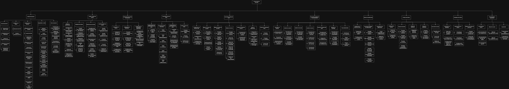

# WBS para el proyecto Hotel de Mascotas
Por: Brendan Ramírez Campos

## Esquema 
```
1. Gestión del Proyecto
    1.1 Inicio del proyecto
        1.1.1 Elaboración del Project Charter
        1.1.2 Identificación inicial de stakeholders
        1.1.3 Definición de objetivos del proyecto
        1.1.4 Definición de alcance preliminar
        1.1.5 Aprobación del proyecto por patrocinadores
    1.2 Reunión con el cliente
        1.2.1 Elaboración del ERS
        1.2.2 Revisión y aprobación del ERS
    1.3 Planificación del proyecto
        1.3.1 Definición del alcance detallado
        1.3.2 Creación de la EDT (WBS)
        1.3.3 Definición del cronograma del proyecto
        1.3.4 Identificación de hitos del proyecto
        1.3.5 Estimación de recursos humanos
        1.3.6 Estimación de costos del proyecto
        1.3.7 Elaboración del presupuesto del proyecto
        1.3.8 Definición de roles y responsabilidades
        1.3.9 Plan de gestión de riesgos
        1.3.10 Plan de comunicaciones del proyecto
        1.3.11 Plan de gestión de calidad
        1.3.12 Plan de gestión de configuración
        1.3.13 Plan de gestión de cambios
    1.4 Seguimiento y control
        1.4.1 Monitoreo del progreso del proyecto
        1.4.2 Control del cronograma
        1.4.3 Control de costos
        1.4.4 Control del alcance
        1.4.5 Seguimiento de riesgos
        1.4.6 Reuniones semanales de equipo
        1.4.7 Reportes de avance al profesor
        1.4.8 Control de versiones del proyecto
        1.4.9 Gestión de incidencias del proyecto
        1.4.10 Testeo Privado
        1.4.11 Testeo público real
    1.5 Cierre del proyecto
        1.5.1 Verificación de cumplimiento de objetivos
        1.5.2 Validación de entregables finales
        1.5.3 Documentación final del proyecto
        1.5.4 Presentación final del sistema
        1.5.5 Lecciones aprendidas
        1.5.6 Cierre administrativo del proyecto

2. Análisis y Diseño del Sistema
    2.1 Análisis de requerimientos
        2.1.1 Identificación de requerimientos funcionales
        2.1.2 Identificación de requerimientos no funcionales
        2.1.3 Análisis del dominio del negocio
        2.1.4 Identificación de actores del sistema
        2.1.5 Definición de casos de uso
        2.1.6 Elaboración de diagramas de casos de uso
    2.2 Modelado del sistema
        2.2.1 Diseño de arquitectura del sistema
        2.2.2 Definición de arquitectura MVC para la plataforma web 
        2.2.3 Definición de arquitectura cliente-servidor
        2.2.4 Diseño de componentes del sistema
        2.2.5 Definición de API del backend
    2.3 Diseño de base de datos
        2.3.1 Identificación de entidades del sistema
        2.3.2 Diseño del modelo entidad-relación
        2.3.3 Normalización de tablas
        2.3.4 Definición de relaciones entre entidades
        2.3.5 Diseño lógico de la base de datos
        2.3.6 Diseño físico de la base de datos
    2.4 Diseño de interfaz de usuario
        2.4.1 Diseño UX de la aplicación móvil
        2.4.2 Diseño UX de la plataforma web
        2.4.3 Creación de wireframes
        2.4.4 Creación de mockups
        2.4.5 Validación de diseño con stakeholders

3. Configuración del Entorno de Desarrollo
    3.1 Preparación del entorno
        3.1.1 Instalación de IDEs de desarrollo
        3.1.2 Instalación de SDK de Android
        3.1.3 Instalación de herramientas de desarrollo web
        3.1.4 Configuración del servidor de desarrollo
    3.2 Configuración de repositorios
        3.2.1 Creación del repositorio en GitHub
        3.2.2 Configuración de control de versiones
        3.2.3 Definición de ramas de desarrollo
        3.2.4 Configuración de integración del equipo
    3.3 Configuración de herramientas colaborativas
        3.3.1 Configuración de gestor de tareas (Trello/GitHub Projects)
        3.3.2 Configuración de almacenamiento de documentos
        3.3.3 Configuración de comunicación del equipo

4. Desarrollo de Base de Datos
    4.1 Implementación del esquema de base de datos
        4.1.1 Creación de base de datos
        4.1.2 Creación de tablas principales
        4.1.3 Creación de relaciones entre tablas
    4.2 Desarrollo de tablas del sistema
        4.2.1 Tabla de usuarios
        4.2.2 Tabla de administradores
        4.2.3 Tabla de mascotas
        4.2.4 Tabla de reservas
        4.2.5 Tabla de habitaciones
        4.2.6 Tabla de servicios adicionales
        4.2.7 Tabla de notificaciones
    4.3 Programación de lógica de base de datos
        4.3.1 Creación de procedimientos almacenados
        4.3.2 Creación de triggers
        4.3.3 Implementación de restricciones de integridad
        4.3.4 Implementación de validaciones de datos
    4.4 Pruebas de base de datos
        4.4.1 Pruebas de integridad de datos
        4.4.2 Pruebas de consultas
        4.4.3 Optimización de consultas

5. Desarrollo de Aplicación Móvil (Android)
    5.1 Configuración del proyecto móvil
        5.1.1 Creación del proyecto Android
        5.1.2 Configuración de dependencias
        5.1.3 Configuración de arquitectura de la app
    5.2 Módulo de registro de usuarios
        5.2.1 Desarrollo de pantalla de registro
        5.2.2 Validación de datos de usuario
        5.2.3 Implementación de autenticación
        5.2.4 Edición de perfil de usuario
    5.3 Módulo de registro de mascotas
        5.3.1 Pantalla de registro de mascota
        5.3.2 Registro de datos de mascota
        5.3.3 Subida de fotografía de mascota
        5.3.4 Edición de información de mascota
        5.3.5 Eliminación de mascota
    5.4 Módulo de reservas
        5.4.1 Pantalla de creación de reserva
        5.4.2 Selección de mascota
        5.4.3 Selección de fechas de hospedaje
        5.4.4 Selección de tipo de hospedaje
        5.4.5 Selección de servicios adicionales
        5.4.6 Validación de disponibilidad
    5.5 Módulo de historial de reservas
        5.5.1 Visualización de reservas activas
        5.5.2 Visualización de reservas finalizadas
    5.6 Centro de notificaciones
        5.6.1 Integración con sistema de notificaciones
        5.6.2 Recepción de notificaciones por correo
        5.6.3 Visualización de notificaciones en la app
    5.7 Pruebas de la aplicación móvil
        5.7.1 Pruebas funcionales
        5.7.2 Pruebas de usabilidad
        5.7.3 Corrección de errores

6. Desarrollo de Plataforma Web Administrativa 
    6.1 Desarrollo del backend
        6.1.1 Implementación de API REST
        6.1.2 Desarrollo de autenticación
        6.1.3 Implementación de control de sesiones
    6.2 Gestión de usuarios
        6.2.1 Visualización de usuarios registrados
        6.2.2 Activación y desactivación de cuentas
        6.2.3 Consulta de información de usuarios
    6.3 Gestión de mascotas
        6.3.1 Visualización de mascotas registradas
        6.3.2 Consulta de información de mascotas
    6.4 Gestión de reservas
        6.4.1 Visualización de todas las reservas
        6.4.2 Confirmación de reservas
        6.4.3 Modificación de reservas
        6.4.4 Cancelación de reservas
    6.5 Gestión de ocupación del hotel
        6.5.1 Visualización de ocupación en tiempo real
        6.5.2 Asignación de habitaciones
        6.5.3 Reasignación de habitaciones
    6.6 Monitoreo de hospedaje
        6.6.1 Visualización de mascotas hospedadas
        6.6.2 Consulta de cuidados especiales
        6.6.3 Consulta de servicios contratados
    6.7 Panel administrativo
        6.7.1 Dashboard de ocupación
        6.7.2 Panel de gestión de reservas
        6.7.3 Panel de control del sistema

7. Sistema de Notificaciones
    7.1 Configuración de servicio de correo
        7.1.1 Integración con servidor SMTP
        7.1.2 Configuración de cuentas de correo
    7.2 Desarrollo de plantillas de notificaciones
        7.2.1 Plantilla de registro de usuario
        7.2.2 Plantilla de confirmación de reserva
        7.2.3 Plantilla de modificación de reserva
        7.2.4 Plantilla de inicio de hospedaje
        7.2.5 Plantilla de finalización de hospedaje
        7.2.6 Plantilla de estado de mascota
    7.3 Automatización de notificaciones
        7.3.1 Envío automático de notificaciones
        7.3.2 Validación de envío de correos

8. Pruebas del Sistema
    8.1 Planificación de pruebas
        8.1.1 Definición de casos de prueba
        8.1.2 Preparación de datos de prueba
    8.2 Pruebas funcionales
        8.2.1 Pruebas de registro de usuarios
        8.2.2 Pruebas de registro de mascotas
        8.2.3 Pruebas de reservas
        8.2.4 Pruebas de gestión administrativa
    8.3 Pruebas de integración
        8.3.1 Integración frontend-backend
        8.3.2 Integración con base de datos
    8.4 Pruebas de rendimiento
        8.4.1 Pruebas de carga del sistema
        8.4.2 Pruebas de respuesta del sistema
    8.5 Corrección de errores
        8.5.1 Identificación de bugs
        8.5.2 Corrección de errores
        8.5.3 Validación de correcciones

9. Despliegue del Sistema  
    9.1 Preparación del despliegue
        9.1.1 Selección de hosting gratuito 
        9.1.2 Configuración del servidor web
        9.1.3 Configuración de base de datos en producción
    9.2 Implementación del sistema
        9.2.1 Despliegue de backend
        9.2.2 Despliegue de frontend web
        9.2.3 Configuración de dominio o URL
    9.3 Validación del sistema en producción
        9.3.1 Pruebas en entorno de producción
        9.3.2 Corrección de problemas de despliegue

10. Documentación y Capacitación
    10.1 Documentación técnica
        10.1.1 Documentación de arquitectura
        10.1.2 Documentación de base de datos
        10.1.3 Documentación de API
    10.2 Manual de usuario
        10.2.1 Manual de aplicación móvil
        10.2.2 Manual de plataforma web
    10.3 Capacitación
        10.3.1 Capacitación para administradores
        10.3.2 Capacitación para personal del hotel
```

## Diagrama
